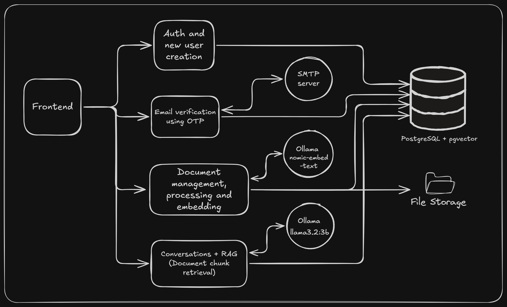

<div align="center">
    <h1>BriefAI</h1>
</div>

BriefAI is a full-stack Retrieval Augmented Generation (RAG) application that allows users to upload documents and ask questions about the documents.

The application processes PDF and Word documents, generates vector embeddings, performs semantic retrieval using PostgreSQL with pgvector, and uses a locally hosted Ollama model to generate contextual answers with source citations.

It also includes email based account verification using OTP, JWT authentication, isolated document retrieval based on logged in user, persistent conversations, conversation aware follow up questions and Dockerized application services.

## Features

### Document Q&A with RAG

- Upload PDF, DOC, and DOCX documents.
- Parse and chunk the document content.
- Generate embeddings of chunks.
- Store and search embeddings using PostgreSQL and pgvector.
- Generate answers only based on retrieved content using llama3.2:3b.
- Display citations for document sources actually referenced in the generated answer.

### Persistent Conversations

- Create and delete conversations.
- Persist users question, answer given by model and citations used in it.
- Use conversation history to support contextual follow up questions.
- Persist conversations to refer after relogin or application restat.

### Authentication & Security

- User registration with name, email, and password.
- Standard strong password validation rules.
- Email verification using a six digit OTP.
- Hashed OTP storage with configurable expiration period.
- Configurable resend OTP cooldown period and max invalid attempt to make the OTP invalid.
- Password hashing before storing into database.
- JWT based authentication.
- User level isolation for documents, conversations, and retrieval.

### Document Management

- Configurable per user document limit and maximum size of the document.
- Well defined document processing lifecycle<br>
  `Upload -> Processing -> Ready/Failed`

For step by step application walkthrough please visit [Application walkthrough.md](/docs/Application_walkthrough.md) file.

## High level application architecture



The frontend, backend and PostgreSQL database runs as docker services while Ollama intentionally runs on the host machine rather than inside the docker. The backend container communicates with it through `http://host.docker.internal:11434`. This avoids duplicating the relatively large Ollama runtime and model files inside docker while keeping the rest of the application reproducible through containers.

### RAG pipeline

The entire RAG pipeline is separated into two parts.

1. Document processing
2. Question answering

#### 1. Document processing

The content of documents are extracted and divided into overlapping chunks. Each chuk is then converted into a 768 dimensional embedding using Ollama's nomic-embed-text embedding model. The generated vectors and it's corresponding metadata is stored inPostgreSQL with pgvector. (The metadata contains information like document id, page number in the document form where the chunk is, user id of the document owner, etc. This metadata is used for citation purpose).


The document status transition from `Uploaded` to `Processing` when processing starts, and in case of successful processing the status changes to `Ready` but in case of processing failure status changes to `Failed`.


#### 2. Question answering


Whenever user asks a question, the application does consider the current conversation context and rewrite the question based on conversation context. Then the question is embedded to perform vector search over users documents in ready state. This search returns the chunks with highest similarity (i.e. relevant content from the document). Now this relevent chunks along with chat history and current question is used to generate the prompt which is further passed to the chat model. Chat model generate the answer using given context.<br>

Here to prevent answering question of one user using other users document, the chunk retrival uses user id as well and match it with document's owner.

After generating answer the application store new entry in conversation. These entries are used to answer any follow up questions in the conversation.

### Authentication workflow

The application uses stateless JWT authentication to protect documents, conversations and retrival of relevant chunks. Every user account also has to be verified using email based OTP.

Below is the flow for new user creation and account verification.


Below is the flow for user login.<br>
Here important point to note is, unless user email is verified JWT will not be generated and on successful login user will automatically redirected to OTP verification page.


## Tech stack

### Backend

| Technology      | Purpose                                      |
| --------------- | -------------------------------------------- |
| Java 21         | Primary programming language for backend     |
| Spring Boot 4   | Building framework                           |
| Spring Security | Authentication                               |
| Spring Data JPA | Persistence layer                            |
| Spring AI       | LLM, embedding, and vector-store integration |
| PostgreSQL      | Persistent relational storage for data       |
| pgvector        | Vector similarity search                     |
| Flyway          | Database schema migration                    |
| Apache PDFBox   | PDF processing                               |
| Apache Tika     | Word document processing                     |
| JavaMailSender  | Email delivery                               |
| Maven           | Build and dependency management              |

### AI

| Component            | Model            |
| -------------------- | ---------------- |
| Runtime              | Ollama           |
| Chat model           | llama3.2:3b      |
| Embedding model      | nomic-embed-text |
| Embedding dimensions | 768              |

### Frontend

| Technology   | Purpose                                           |
| ------------ | ------------------------------------------------- |
| React        | User interface                                    |
| Vite         | Frontend build tool                               |
| React Router | Client side routing                               |
| Nginx        | Production frontend serving and API reverse proxy |

### Infrastructure

| Technology                  | Purpose                           |
| --------------------------- | --------------------------------- |
| Docker                      | Application containerization      |
| Docker Compose              | Local multi service orchestration |
| PostgreSQL/pgvector (image) | Containerized database            |
| Docker volumes              | Document and database persistence |

## Running BriefAI locally

### Prerequisites

Install below tools before running the project

- Docker desktop
- Ollama
- Git

> You do not need to install Java, Maven, Node.js, or PostgreSQL to run the application using Docker.

> Here running Ollama on host/local machine is intentional choice rather than pulling huge Docker images for the runtime and models.

Once all prerequisites are installed follow steps given below.

#### 1. Clone the repository

Clone this github repository using below commands

```
git clone https://github.com/Akhil-Selukar/BriefAI.git
cd BriefAI
```

#### 2. Install the Ollama Models

Before running below commands make sure that Ollama is installed and running.<br>

Pull chat model using below command

```
ollama pull llama3.2:3b
```

Pull embedding model using below command

```
ollama pull nomic-embed-text
```

Make sure that both the models are pulled successfully. Use below command to verify.

```
ollama list
```

it should return `llama3.2:3b` and `nomic-embed-text`

Finally make sure ollama is available on port `11434`.<br>
Go to below url, it should say `Ollama is running`

```
http://localhost:11434
```

#### 3. Configure Environment Variables

Rename existing `.env.example` to `.env` or create new `.env` file and copy content of `.env.example` into it.<br>

Edit this `.env` file with your values for fields mentioned inside `<< >>`

> Important thing to note here is, while setting up Gmail SMTP, Generate and use Google app password for environment variable `MAIL_PASSWORD`. Do not use your normal gmail password.

#### 4. Build and start the application

Make sure that Ollama is running.

Open command prompt at the root folder (i.e. BriefAI) and run below command.

```
docker compose up --build -d
```

Wait for the image to build and start. Once done check the status for running containers using below command. It should say 'Healthy'

```
docker compose ps
```

Once the containers are running, visit `http://localhost:3000`, BriefAI will be running on port 3000.

> As the Ollama is running on host/local system hence Springboot container access it at `host.docker.internal:11434`

> In case of any of the container is not running (status is not healthy) then use below commands to check logs.
>
> For backend use `docker compose logs -f backend` and for frontend use `docker compose logs -f frontend`.
>
> To stop and start the application use `docker compose down` and `docker compose up -d` respectivelly.

## API Overview

All apis for the application are prefixed with `/api/v1`.

### Authentication

| Method | Endpoint           | Description             |
| ------ | ------------------ | ----------------------- |
| POST   | /auth/register     | Register new user       |
| POST   | /auth/verify-email | Verify email using OTP  |
| POST   | /auth/resend-otp   | Request for another OTP |
| POST   | /auth/login        | Login to user account   |

### Documents

| Method | Endpoint                | Description                         |
| ------ | ----------------------- | ----------------------------------- |
| POST   | /documents              | Upload a new document               |
| GET    | /documents              | List all documents uploaded by user |
| GET    | /documents/{id}         | Retrieve metadata of the document   |
| POST   | /documents/{id}/process | Process and embed the document      |
| DELETE | /documents/{id}         | Delete the document                 |

### Conversation

| Method | Endpoint                     | Description                            |
| ------ | ---------------------------- | -------------------------------------- |
| POST   | /conversations               | Create a new conversation              |
| GET    | /conversations               | List all conversations created by user |
| GET    | /conversations/{id}          | Get conversation metadata              |
| GET    | /conversations/{id}/messages | Load messages in the conversation      |
| DELETE | /conversations/{id}          | Delete the conversation                |

### RAG

| Method | Endpoint  | Description                     |
| ------ | --------- | ------------------------------- |
| POST   | /chat/ask | Ask question to the application |

## Design Decisions

### 1. PostgreSQL + pgvector

The application uses pgvector rather than introducing a separate vector database.

This keeps relational application data and vector retrieval within the PostgreSQL ecosystem, still providing semantic similarity search.

For the scale of this project, this design choice reduces infrastructure complexity without sacrificing the core RAG capabilities.

### 2. Local Ollama Models

Ollama is selected so that the RAG pipeline can run without requiring a paid LLM API. The current models used are below.

- llama3.2:3b -> For natural language response generation
- nomic-embed-text -> For embedding.

This choice is made to make local development inexpensive and keep the model runtime under the developer's control. But it has a tradeoff as well. <b>The model `llama3.2:3b` is highly optimized for low-resource hardwares like laptops and desktops but it's reasoning capability is considerably lower that other large hosted models.</b>

### 3. Synchronous Document Processing

At present the document processing is kept synchronous, and after clicking on process the user has to wait for the document processing to finish. This is made intentional considering the scope of the application is local and main focus is on RAG pipelines rather than asynchronous processing. So to make architecture simple the document processing is kept synchronous. In case of failure in document processing user will have to restart it manually.<br>
For actual production version the processing can be made asynchronous by using queues and background workers to process documents. Retry and poison queues to handle failed processing, etc.

## Known limitations

### 1. LLM Reasoning

The current model used (i.e. llama3.2:3b) is optimized model for small low resource systems and can make arithmetic or reasoning errors even when the correct values were successfully retrieved from the source document.

### 2. Synchronous processing

Document processing is currently a synchronous process, hence large documents might block the request for some time. In large scale production system, asynchronous processing architecture would be more appropriate to handle high volume of documents.

### 3. Local Model Runtime

The current setup user locally running Ollama. Hosting the same model runtime in a cloud environment would require sufficient memory and compute capacity and may not be cost-effective. Hence on production system better option is to use managed LLM model API's.

### Security considerations

In this application several application level security controls are implemented. Below is the list of them.

- BCrypt password hashing
- Email verification before login
- Hashed OTP persistence
- OTP expiration
- OTP attempt limits
- OTP resend cooldown
- Invalidation of previous OTPs
- Stateless JWT authentication
- Protected REST endpoints
- User scoped document access
- user scoped semantic retrieval
- user scoped conversations
